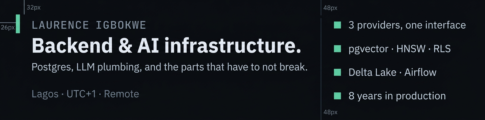

<!--
  github.com/laurence702/laurence702 — profile README
  Repo must be named exactly `laurence702` and be PUBLIC with a README at root.

  Banner: build hero.png in the KX visual system (spec in _ops/social/HERO_CARD_SPEC.md),
  1280×320, commit it to this repo at /hero.png, then the img tag below resolves.

  RULE FOR THIS FILE: every claim is checkable or attributed. No streak widgets,
  no trophy cases, no badge walls, no "connect with me" icon rows. The restraint
  is the signal — this profile is read by people who can tell the difference.
-->

### Laurence Igbokwe

Backend engineer, eight years. I work on the layer between an LLM and a product that has real users — provider abstraction, retrieval, cost accounting, and the reliability plumbing that decides whether an AI feature survives contact with traffic.

Lagos, UTC+1. Remote. Full overlap with European teams, mornings with US East.

---

### What I actually work on

**Testable AI systems.** A mock LLM provider and fixture spec so a generation pipeline can be tested deterministically — no live API calls, no spend, runs in CI. Plus an AI build-failure recovery loop: fetch the failed build's logs, extract the actionable error, patch the source with full-tree context, rebuild, bounded at three cycles.

**Schema evolution you can trust.** Spec-to-SQL migration generation with column-level diffing, severity-tagged destructive-change warnings (table drops, column drops, narrowing type changes), up/down rollbacks, and TypeScript types generated from the live schema.

**Retrieval on Postgres.** pgvector with HNSW, hybrid keyword + vector search, row-level security enforced inside the retrieval query rather than in application code, and recall@k measured against a golden set instead of guessed at.

**Data pipelines.** A Medallion lakehouse over live USGS seismic feeds — Bronze raw, Silver cleaned Delta tables, Gold aggregates — orchestrated with Airflow, served through Streamlit.

**The boring half.** HMAC-verified webhook ingestion with transient-vs-permanent failure classification, idempotent money movement over Paystack, GDPR column-level PII masking and retention automation on an ABTA/ATOL-regulated platform.

---

### Public work

| | |
|---|---|
| **[QuakeWatch](https://github.com/laurence702/QuakeWatch)** | Databricks Medallion lakehouse over live USGS seismic feeds. Delta Lake ACID tables, PySpark transforms, Airflow DAGs, magnitude-threshold alerting, geospatial Streamlit dashboard. `Python · Databricks · Airflow · Delta Lake · Docker` |
| **[pgvector-rls-rag](https://github.com/laurence702/pgvector-rls-rag)** | A RAG service where Postgres is the entire data layer — no vector database, no search cluster. Multi-tenant retrieval with RLS in the query, hybrid search, and a recall@k eval harness. Built in public over five phases. `TypeScript · Postgres · pgvector` |

Most of what I've shipped is client or contract work and isn't mine to publish. Where that's true I write about the architecture and the decisions instead — the reasoning travels even when the repository can't.

---

### Stack

**Languages** TypeScript · JavaScript · Python · PHP · SQL · Bash
**Runtimes** Node.js (Express, Fastify, NestJS) · Deno edge functions · Laravel
**Data** PostgreSQL · pgvector · MySQL · Redis · Delta Lake · Parquet
**Platform** Supabase · Cloudflare (Workers, R2, Pages) · Docker · AWS · GCP · Firebase
**AI** OpenAI · Anthropic · Gemini · RAG · embedding and retrieval pipelines · eval harnesses
**Practice** pytest · Jest · Cypress · Sentry · OpenAPI 3.0 · GitHub Actions

---

### Writing

I publish decisions rather than tutorials — a call I made, why I made it, and where I'd choose differently. Currently running **Postgres Only**, a five-phase build of a production-shaped RAG service on Postgres alone.

[LinkedIn](https://www.linkedin.com/in/laurence-igbokwe-166597152) · [keonix.dev](https://keonix.dev) · hello@keonix.dev

Open to senior backend and AI-infrastructure roles, and to short fixed-scope engagements through Keonix Systems.
